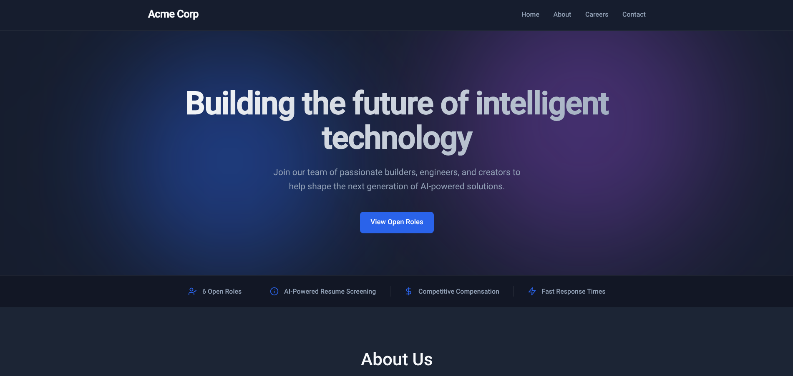
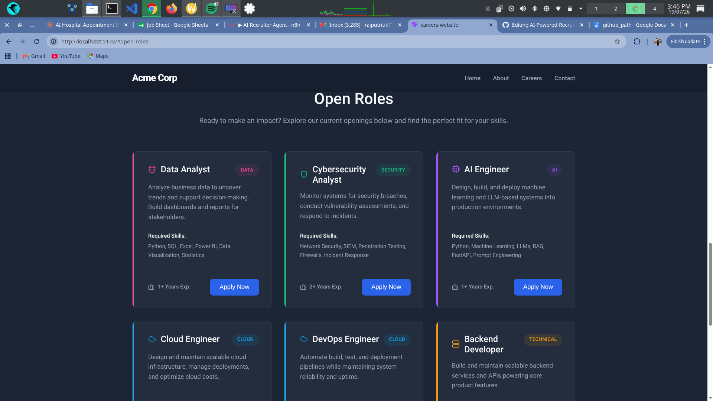
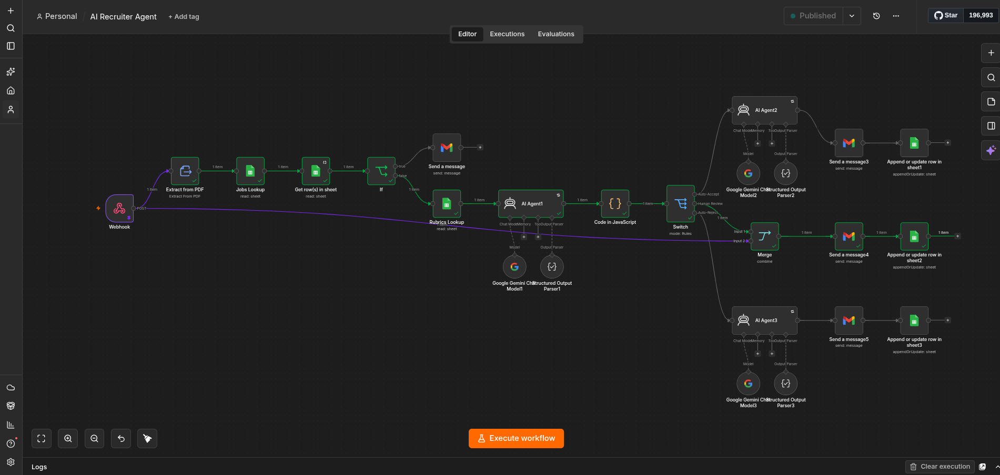
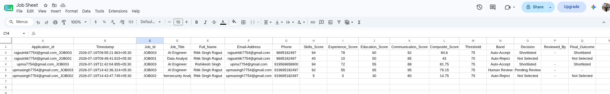

# AI-Powered Recruitment Platform

An end-to-end, multi-role hiring platform that automates resume screening using AI — from a custom careers website through to dynamic, category-specific candidate evaluation, with a human-in-the-loop safety net for borderline cases.

**[Live Demo](https://ai-powered-recruitment-platform-mb596ar3x-team-heterogeneous.vercel.app/)** ·

---

## Overview

Traditional resume screening automation usually applies one generic scoring rule to every applicant, regardless of role. This project takes a different approach: **each job category has its own dedicated evaluation rubric**, dynamically pulled and applied at runtime — so a Cybersecurity Analyst resume is judged on incident response and SIEM experience, while an AI Engineer resume is judged on LLM and RAG experience, all through the same underlying pipeline.

The system doesn't just accept or reject. Scores falling within a configurable band around each job's threshold are routed to a **Human Review** queue instead of being auto-decided, so borderline candidates get a real second look rather than a coin-flip automated call.

## Screenshots

**Careers Website — Hero**


**Careers Website — Job Listings**


**n8n Automation Pipeline**


**Applications Log (Auto-Accept / Human Review / Auto-Reject)**


## Architecture

```
Careers Website (React/HTML frontend)
        │
        ▼
   n8n Webhook
        │
        ▼
Duplicate Application Check ──► (if duplicate) → Notify candidate, stop
        │
        ▼
   Jobs Lookup (Google Sheets) — pulls job description, required skills,
        │                        weight_profile, and threshold for the
        │                        selected role
        ▼
  Rubrics Lookup (Google Sheets) — pulls the category-specific system
        │                          prompt (Data / Security / AI / Cloud / Technical)
        ▼
   Resume Text Extraction (PDF → text)
        │
        ▼
  Gemini Scoring (Structured Output Parser)
        │            returns: skills_score, experience_score,
        │            education_score, communication_score
        ▼
  Weighted Composite Score (Code node)
        │            applies each job's own weight_profile,
        │            computes a single composite score + band
        ▼
     Switch (by band)
        │
   ┌────┼────────────┐
   ▼    ▼             ▼
Auto-  Human       Auto-
Accept Review      Reject
   │    │             │
   ▼    ▼             ▼
Personalized   Internal HR      Personalized
email + Sheets  notification +   email + Sheets
log            Sheets log        log
```

A separate scheduled workflow sends HR a daily digest of that day's shortlisted candidates. A separate error-handling workflow monitors the main pipeline for node failures and sends an alert if anything breaks.

## Features

- **Dynamic, role-specific scoring** — one scoring pipeline, behavior changes per job via data lookups (not duplicated logic per role)
- **Weighted, multi-criteria evaluation** — each job defines its own weighting across skills, experience, education, and communication
- **Three-way decision routing** — Auto-Accept / Human Review / Auto-Reject, based on a configurable band around each job's threshold
- **Duplicate application detection** — prevents reprocessing the same candidate/job combination
- **Automated, personalized candidate communication** — structured, AI-generated emails for both accepted and rejected candidates
- **Internal HR alerts** for borderline candidates, with resume attached
- **Daily digest email** summarizing shortlisted candidates
- **Error-handling workflow** for pipeline monitoring
- **Custom, responsive careers website** — dynamic job listings driven by a single data array, direct webhook-based application submission

## Tech Stack

| Layer | Technology |
|---|---|
| Frontend | React / HTML, CSS, JavaScript |
| Automation / Backend Logic | n8n |
| AI / Scoring | Google Gemini API (Structured Output) |
| Data Storage | Google Sheets |
| Email | Gmail (via n8n) |
| Hosting | Vercel |

## How It Works — Job Data Model

Each job role is defined as a single row in a Jobs sheet:

```
job_id | title | category | description | required_skills | min_experience | weight_profile | threshold
```

`weight_profile` is a JSON object (e.g. `{"skills":40,"experience":25,"education":15,"communication":20}`) allowing each role to weigh evaluation criteria differently — a Cybersecurity role can weight hands-on skills more heavily than a Data Analyst role, for example.

Adding a new job role requires adding one row to this sheet — no new workflow logic needed.

## Rubrics

Each job `category` (Data, Security, AI, Cloud, Technical) has its own row in a Rubrics sheet containing a tailored system prompt — this is what gives the AI scoring genuinely different evaluation criteria per category, without needing separate AI agents or duplicated workflow branches.

## Current Open Roles (Demo Data)

- Data Analyst
- Cybersecurity Analyst
- AI Engineer
- Cloud Engineer
- DevOps Engineer
- Backend Developer

## Setup Notes

This repository contains the frontend only. The backend automation (n8n workflow, Gemini prompts, Google Sheets structure) is hosted separately. To run your own instance, you'll need:
1. An n8n instance (cloud or self-hosted) with the workflow imported
2. A Google Sheets document set up with the Jobs, Rubrics, and Applications schemas described above
3. A Gemini API key connected to your n8n credentials
4. Your own webhook URL set as an environment variable in this frontend (`WEBHOOK_URL`)

## Author

Built by Ritik Singh Rajput — [LinkedIn](https://www.linkedin.com/in/ritik-singh-rajput-49b964319/) · [GitHub](https://github.com/Rajputritik9695)
